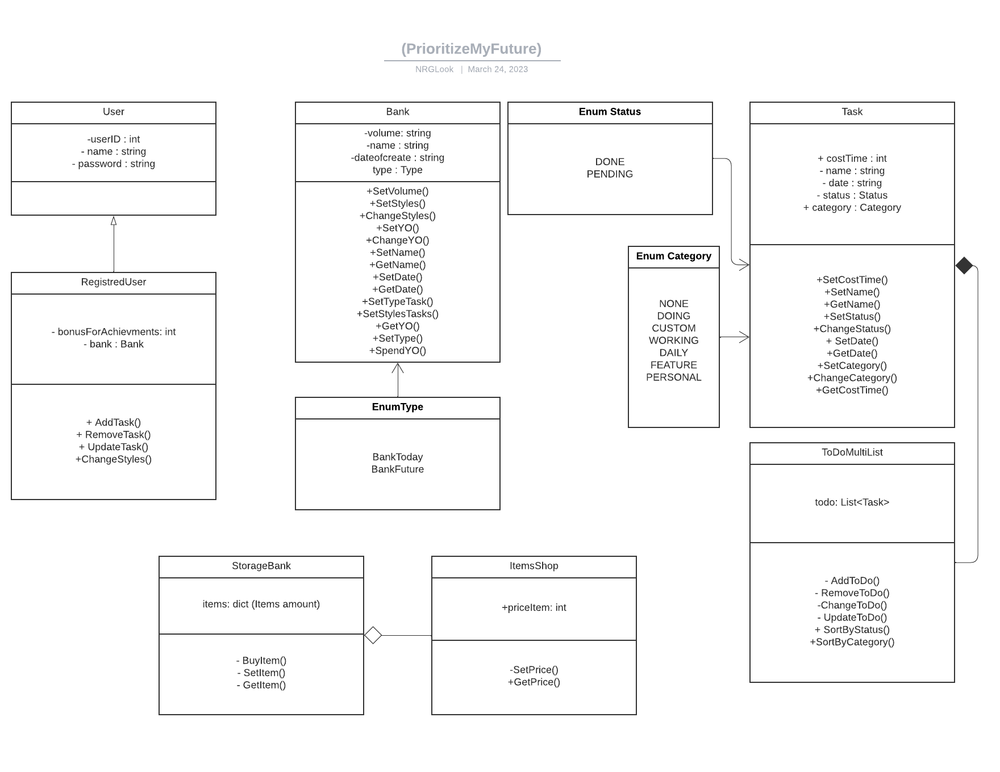

# OOP
Tsikhanionak Ilya Alexandrovich 153504
# PrioritizeMyFuture
  This time management app is designed to teach you how to truly value time. When you enter it, you will be given 2 containers, we called them "banks":   
a) - The Bank of Today;  
b) - The Bank of The Future Me.   
  In the bank of today, it will be no matter how strange it is today. In what form can we put the day in some obscure jar? In the form of some conventional units that you will determine. Oh, so it's nonsense, you say. It's not that simple ...
1) Decide when your day will start (the time is most convenient for you - be it evening, morning or even night) - at this time every day our bank will be updated. This will be our starting point.
2) By default, for simplicity, you will already have conditional units by default, namely: 1440 y.o. which are just the same equivalent to 1440 minutes, which make up 1 day.
3) After completing the training on the functionality of the application, you can already add your 1 task, in which you can set the execution time, hashtag, etc.
  There is one thing, but every day THE COUNTER WILL BE SET TO ZERO and all the TIME that you did NOT PLAN will BURN. That is, you have planned things for 100 y.o. let's say 1300 y.o. , 100 y.o. - will be transferred to The Bank of The Future Me, and 1300 y.o. will just take and burn, similarly, everything happens in real life, the time that we waste is simply lost, once and for all, and there remains only the one in which we were really busy. 
  The Bank of The Future Me, what is it? What we can get for our y.o. About this and more, you can find out by downloading the PrioritizeMyFuture application. We are waiting for you! Appreciate the time, because it is one of the most valuable resources that everyone has.
 # Class Diagram 
 
